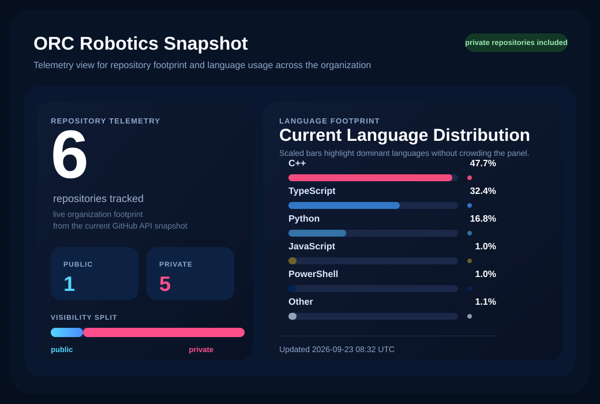

# ORC Robotics

Robotics and AI engineering focused on real-world systems, computer vision and embedded development.

Developed at SENAI ORC.

---

## Organization Snapshot

  

<!-- stats:start -->
- Repositories analyzed: `6 total` (`5 private`, `1 public`)
- Language distribution by code footprint: `C++ 47.7%`, `TypeScript 32.4%`, `Python 16.8%`, `JavaScript 1.0%`, `PowerShell 1.0%`, `Shell 0.4%`
- This snapshot includes private repositories without exposing internal source code.
- Last updated: `2026-07-10 06:53 UTC`
<!-- stats:end -->

> Statistics are generated automatically through GitHub Actions and refreshed directly from the GitHub API once `ORG_STATS_TOKEN` is configured. This keeps the private repository snapshot accurate without cloning repositories to a local machine.

## Current Languages

<!-- languages:start -->

  

Active languages currently detected across ORC Robotics: `C++`, `TypeScript`, `Python`, `JavaScript`, `PowerShell`, `Shell`, `Batchfile`, `CSS`.
<!-- languages:end -->

---

## Focus Areas
- Autonomous robotics
- Computer vision
- Embedded systems (ESP32, Raspberry Pi)
- Competition engineering (WorldSkills, OBR)

---

## Projects
- Autonomous rescue robot for OBR, using computer vision for navigation and victim detection
- Computer vision system for object and environment perception (OpenCV)
- Modular robotic platform for rapid prototyping and testing

---

## Stack
- C++ / Python / TypeScript
- OpenCV
- ROS2 (future)
- Embedded systems
- Telemetry and operational dashboards

---

## About
We design and build high-performance robotic systems, combining mechanical design, electronics and software into fully integrated solutions.
