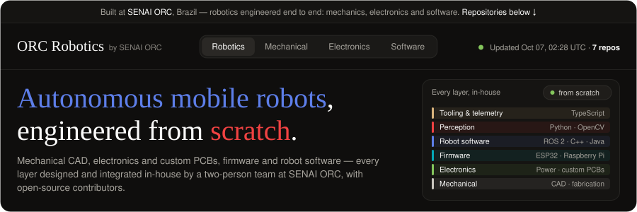
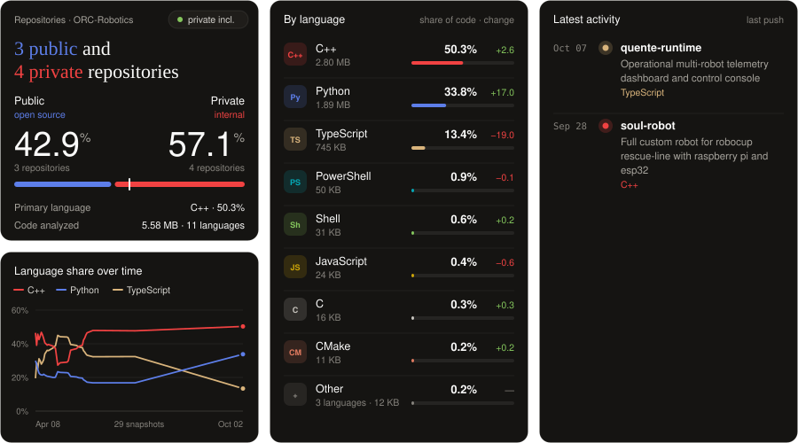
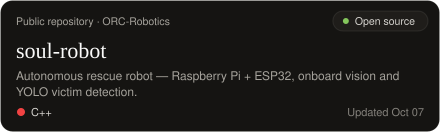
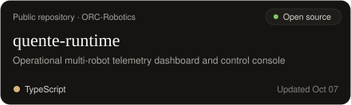

  

  

<!-- repos:start -->

  
  

<!-- repos:end -->

 

| | |
|:--|:--|
| **Engineering** | Mechanical design in CAD · Electrical design and custom PCBs · Firmware for ESP32 and Raspberry Pi · Robot software in ROS 2 and C++ · Computer vision · Telemetry and tooling |
| **Focus** | Autonomous mobile robotics: navigation, perception and control, built as one integrated machine |
| **Stack** | C++ · ROS 2 · Python · Java · TypeScript · OpenCV · ESP32 · Raspberry Pi · PCB design · CAD |

  We design and build robotic systems end to end — mechanics, electronics and software as one integrated machine. 
  Stats refresh daily through GitHub Actions. Private repositories are counted, never exposed.

